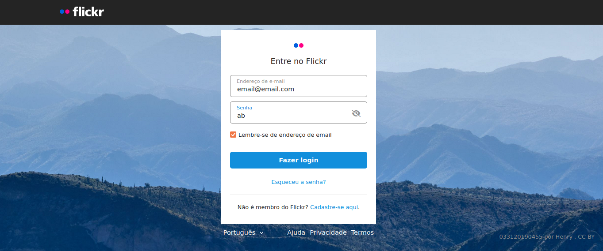

# Recriando a página de login do Flickr

Uma recriação da [página de login](https://flickr.com/login) do Flickr é apresentada neste projeto. Além da aplicação de Javascript, são utilizados conceitos de CSS Flexbox e Grid Layout. 

## :gear: Tecnologias
- HTML
- CSS
- JavaScript

## :art: Layout

